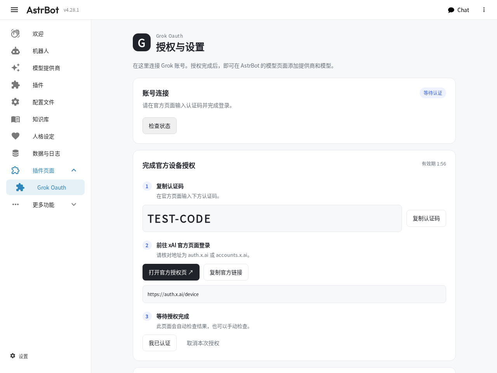
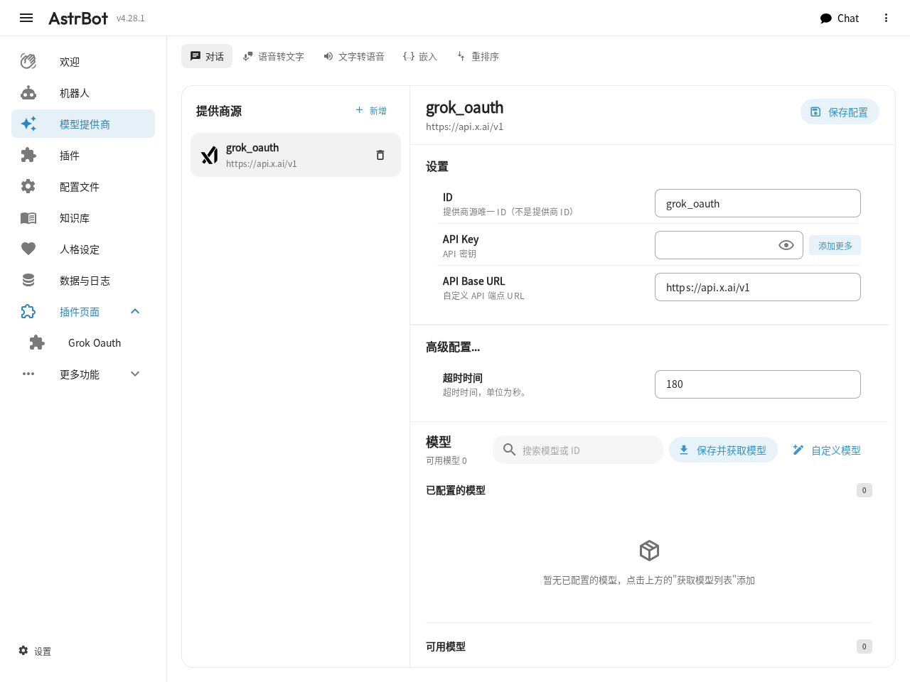
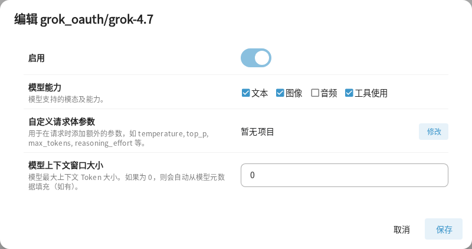
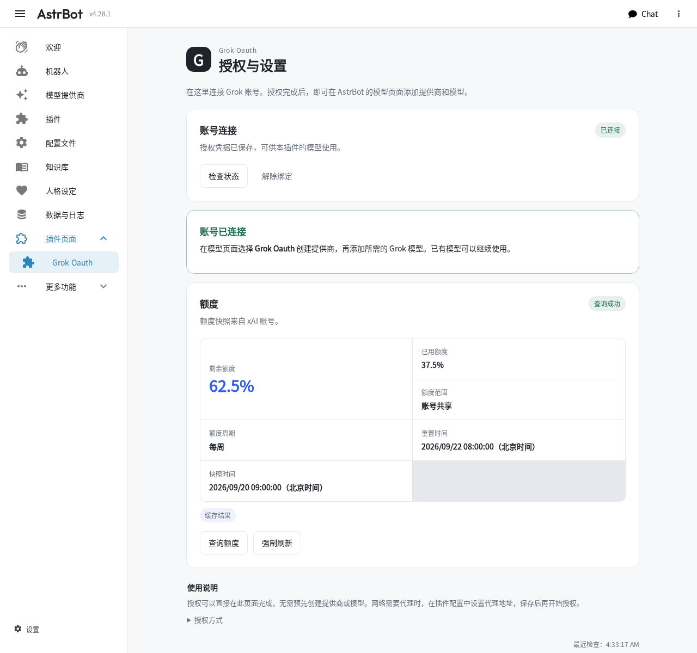

# 配图配置指南

适用插件 0.8.2，截图使用 AstrBot 4.28.1 中文界面。截图全部来自合成测试环境，示例认证码不能使用，额度为演示数值。

## 1. 安装插件

在 AstrBot「插件」页面使用仓库地址 `https://github.com/RhoninSeiei/astrbot_plugin_grok_oauth` 安装，或选择上传对应版本的 ZIP。安装成功后应出现 **Grok Oauth**，并有「授权与设置」页面入口。插件市场是否可检索以 AstrBot Cloud 的审核与展示结果为准。

已有安装应使用 AstrBot 的插件更新流程；更新前备份插件配置与插件数据目录。令牌位于插件数据目录，勿把该目录放入 Git、Issue 或安装包。

## 2. 连接 Grok 账号

打开「插件页面 → Grok Oauth → 授权与设置」。需要代理时，先在本插件配置中填写 `proxy` 并保存，按宿主提示重载插件后再开始授权。无需先创建模型。

`oauth_client_id` 默认使用公开 Grok CLI 客户端 ID，`oauth_client_profile` 是供页面显示的配置名称。客户端 ID 是公开标识，不是客户端密钥；参考官方客户端不表示 xAI 对本插件的授权或背书。如果具有可用于该设备码流程的自有 xAI OAuth 客户端，可由管理员填写其实际 ID 和名称；任意自造的 ID 或修改配置名称都不会赋予权限。配置名称不会改变上游客户端身份。

点击「连接 Grok 账号」，确认页面中的 OAuth 客户端说明。复制认证码和官方链接，在浏览器打开链接并完成授权。页面会自动检查，也可点击「我已认证」立即检查。



如果 AstrBot 插件页面限制弹出新窗口，可复制链接到浏览器完成授权。不要把认证码发送到群聊，也不要导入其他客户端的令牌文件。认证码过期后重新发起授权。

如果当前宿主没有提供页面入口，可在管理员私聊依次发送：

```text
/grok_oauth_login
/grok_oauth_login confirm
/grok_oauth_status
```

第一条命令显示实际客户端资料，确认后执行第二条命令，打开返回的官方链接并输入认证码；浏览器授权完成后，再执行第三条命令查看结果。后台持续查询设备授权状态，无需复制 access token 或 refresh token。中途退出可发送 `/grok_oauth_cancel`；解除本插件账号绑定使用 `/grok_oauth_disconnect`。这些命令只允许管理员私聊。

## 3. 创建提供商源并添加模型

进入「模型提供商」，点击「新增」，选择 **Grok Oauth**。



提供商源 ID 可以使用 `grok_oauth`。API Base URL 保持内置值；通用 API Key 字段留空。点击「保存并获取模型」，在模型列表中找到 `grok-4.7`，通过该行的添加按钮创建模型。

一个账号授权可供该插件的多个模型使用。提供商源保存连接信息，每个模型分别保存模型名、能力和参数。不要为同一账号重复复制令牌。

## 4. 核对模型设置

打开刚添加的模型，例如 `grok_oauth/grok-4.7`。



| 设置 | 使用说明 |
| --- | --- |
| 模型名称 | `grok-4.7`；模型 ID 是 AstrBot 引用标识，名称相似不代表请求模型相同 |
| 模型能力 | 仅勾选文本、图像、工具调用；如果默认选中了音频或视频，请取消勾选 |
| 模型上下文窗口大小 | `0` 使用 AstrBot 自动获取规则；也可依据当前官方模型规格手动填写 |
| 自定义模型参数 | 可以留空；需要推理强度时使用下方示例 |

```json
{"reasoning_effort": "high"}
```

Grok 4.7 支持 `low`、`medium`、`high`、`xhigh`。官方当前标注上下文窗口为 500,000 token；实际可用量还需扣除历史、工具和输出预算。[官方模型规格](https://docs.x.ai/developers/grok-4-7)

支持的其他自定义参数为 `reasoning`、`temperature`、`top_p`、`max_tokens`、`max_output_tokens`。两种输出上限字段不要同时使用；参数须符合所选模型规则。字段优先级与限制见[开发接口](API.md)。

保存后重新打开模型，确认设置保留。旧版本模型会在插件启动或重载时规范化为原生结构，并保留已有 ID、模型名和显式设置。

## 5. 选择模型并验证

在目标会话或正在使用的 Agent 配置中选择刚添加的模型，然后发送「请回复连接成功」。使用其他插件管理模型时，在该插件的模型选项中选择同一个提供商 ID。

管理员可在私聊运行：

```text
/grok_oauth_test grok_oauth/grok-4.7
```

ID 应替换成实际创建的值。该命令会发起真实聊天请求并消耗相应额度。添加模型不会自动修改所有会话或其他插件的模型选择。

## 6. 查看额度

回到「授权与设置」，点击额度查询或刷新按钮。



普通查询可以复用短时缓存；刷新也遵守上游限流。未知值保留为未知；历史快照会明确标注。管理员直接命令分别为 `/grok_oauth_usage` 和 `/grok_oauth_usage_breakdown`。

普通用户可向 Grok 模型询问「当前 Grok 额度还有多少」或「Grok 额度消耗来源」。群聊默认不开放；管理员需在 `usage_group_allowlist` 填入该群的完整 AstrBot `unified_msg_origin`，例如 `平台实例ID:GroupMessage:群ID`。复制实际会话标识，勿只填群号。

命令时间使用 AstrBot 进程的本地时区并显示 UTC 偏移；当前授权页采用北京时间。来源百分比按上游原值展示，不保证相加为 100%。

## 常用功能开关

| 配置 | 默认 | 何时修改 |
| --- | --- | --- |
| `proxy` | 空 | 填写本插件可访问的完整代理 URL，例如 `http://proxy.example.com:8080`；空值表示直连，不自动继承环境代理 |
| `oauth_client_id`、`oauth_client_profile` | 公开 Grok CLI 参考配置 | 普通使用保留默认值；只有具有适用的自有客户端时才修改 |
| `search_enabled`、`search_tools_enabled` | 开启 | 关闭搜索能力或搜索工具 |
| `images_enabled`、`tools_enabled` | 开启 | 关闭图片生成编辑或 Agent 图片与视频工具 |
| `image_model` | `grok-imagine-image-2.0` | 账号具有其他兼容图片模型权限时 |
| `usage_tools_enabled` | 开启 | 关闭模型额度工具；不影响管理员命令与页面 |
| `usage_group_allowlist` | 空列表 | 开放指定群的额度查询 |
| `media_hosts` | 空列表 | 允许网络图片导入，并可扩展视频结果下载主机；填写精确 HTTPS 主机名，不填完整 URL 或通配符 |
| `allowed_image_roots` | 空列表 | 添加可信图片目录；空列表仍允许 AstrBot 临时目录及本插件图片资产目录 |
| `videos_enabled` | 开启 | 关闭视频生成、编辑和公共视频能力 |
| `video_source_hosts` | 空列表 | 扩展视频编辑输入来源主机；QQ 临时视频主机已内置，此项不沿用 `media_hosts` |
| `allowed_video_roots` | 空列表 | 明确授权可信本地视频目录；空列表拒绝全部本地视频路径，不继承图片目录权限 |
| `search_provider_id`、`tools_provider_id` | 空 | 明确允许其他主模型调用指定 Grok 搜索或图片与视频实例 |

图片工具默认仅接受 Grok 发出的调用，向原会话发送附件。网络图片导入默认关闭；已经提供的 data URI 和允许目录中的图片可用。发送失败时可用操作 ID 重发原图，避免重新生成。额度工具没有跨模型例外。

三个网络用途分别管理：图片输入使用 `media_hosts`；视频生成结果默认允许 `vidgen.x.ai`，额外结果域名使用 `media_hosts`；外部视频输入默认允许 `multimedia.nt.qq.com.cn`，额外输入域名使用 `video_source_hosts`。配置 `proxy` 后，固定视频结果与 QQ 视频来源使用无凭据代理下载；额外媒体主机仍须满足公网 DNS 校验。不要用扩大域名或本地根目录权限来解决不可信附件来源。

完整配置字段以 AstrBot 插件配置页为准。故障处理见[常见问题](FAQ.md)。

## 视频生成与编辑

0.8.2 的视频能力由本插件提供生成、编辑、任务查询和视频读取；发送与通知交给调用插件处理。三个Agent工具只返回任务状态及资产ID，不自动向群或私聊发送视频。

文生和图生视频支持6或10秒、480p档位；编辑支持本插件同账户、同会话生成或安全导入且不超过8.7秒的视频。视频与参考图联合编辑当前明确不支持。单文件最大20 MiB。`videos_enabled` 控制视频能力；Agent工具还受tools_enabled和tools_provider_id控制。原有图片工具行为保持。

调用插件可通过公共Provider方法提交任务、等待、读取MP4 bytes，自行安排发送与重试。可用 `/grok_video_status <job_id>` 主动查询任务。只有普通Agent工具循环时，不会自动发送视频，需要调用插件处理工具返回的job_id。

完整参数与代码见[跨插件视频调用契约](API.md#跨插件视频调用契约)，QQ群已验证的发送示例见[qq_video_sender.py](../examples/qq_video_sender.py)。该示例由调用插件显式执行，Grok插件不会加载。

模式声明、QQ 外部视频导入与提交状态见[接入契约](MATOI_VIDEO_HANDOFF.md)。接入时同时检查插件版本、方法存在及能力声明，避免向旧版本提交不支持的模式。

## 独立调试日志

普通配置中的 `transport_diagnostics` 控制 AstrBot 后台诊断，`transport_debug_file` 控制独立文件，两项均默认关闭并需重载插件生效。独立文件位于 `data/plugin_data/astrbot_plugin_grok_oauth/debug/transport.jsonl`，按 1 MiB 轮转，保留一个备份。仅记录本插件的脱敏诊断字段，不捕获第三方原始日志。两个开关均不修改宿主或其他插件的日志设置。
